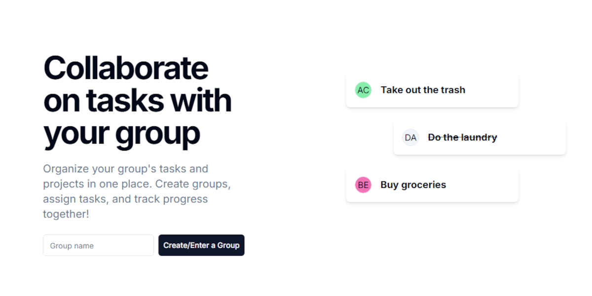
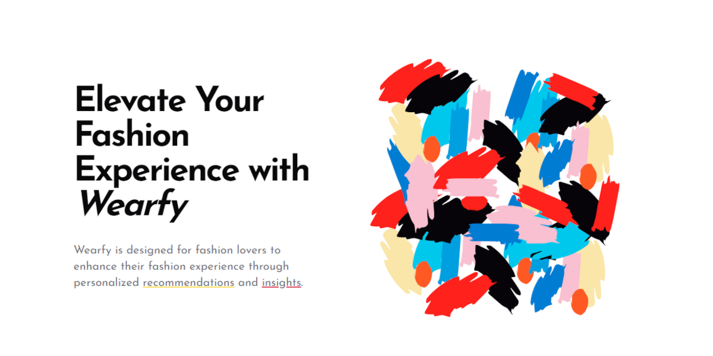
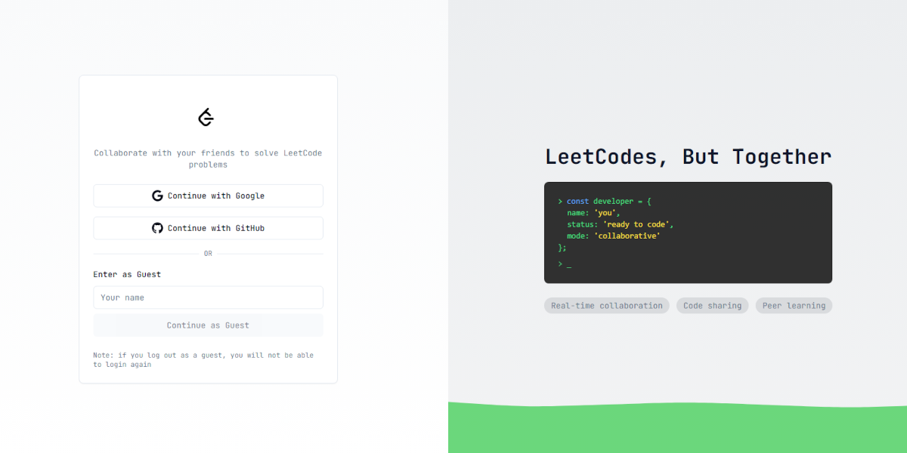

 
## 🔨 Languages and Tools:

 
## 📃 Badges

  
  
  
  
  
  
  
  

 

## 🌟 Projects/Products

  <h3>TaskCircle</h3>
  
  
Task management platform with social authentication

  <a href="https://taskcircle.vercel.app">🔗 Live Demo</a>

  <h3>Wearfy</h3>
  
  
E-commerce platform for custom apparel

  <a href="https://wearfy.online">🔗 Live Demo</a>

  <h3>SeuMimo</h3>
  
  
Gift registry and wishlist platform

  <a href="https://seumimo.com">🔗 Live Demo</a>

  <h3>Readapt</h3>
  
  
Digital library and reading tracker

  <a href="https://readapt.vercel.app">🔗 Live Demo</a>

  <h3>LeetGroup</h3>
  
  
Collaborative coding platform

  <a href="https://leetgroup.vercel.app">🔗 Live Demo</a>

  <h3>SecureChains</h3>
  
  
Blockchain security system

  <a href="https://securechains.vercel.app">🔗 Live Demo</a>

