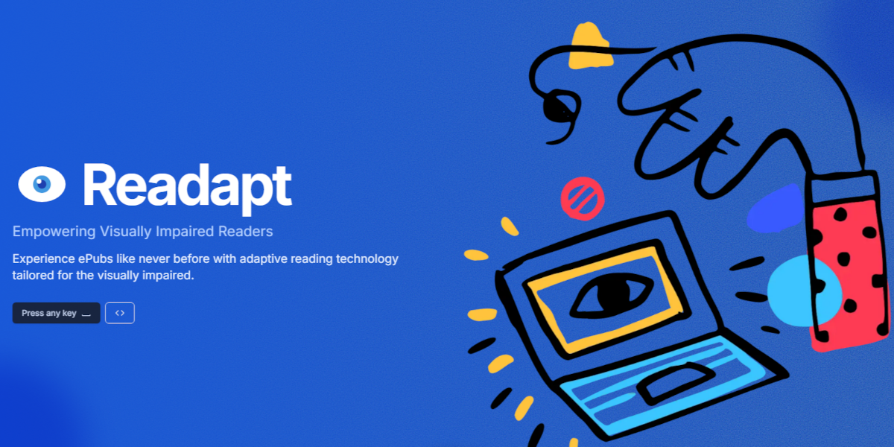
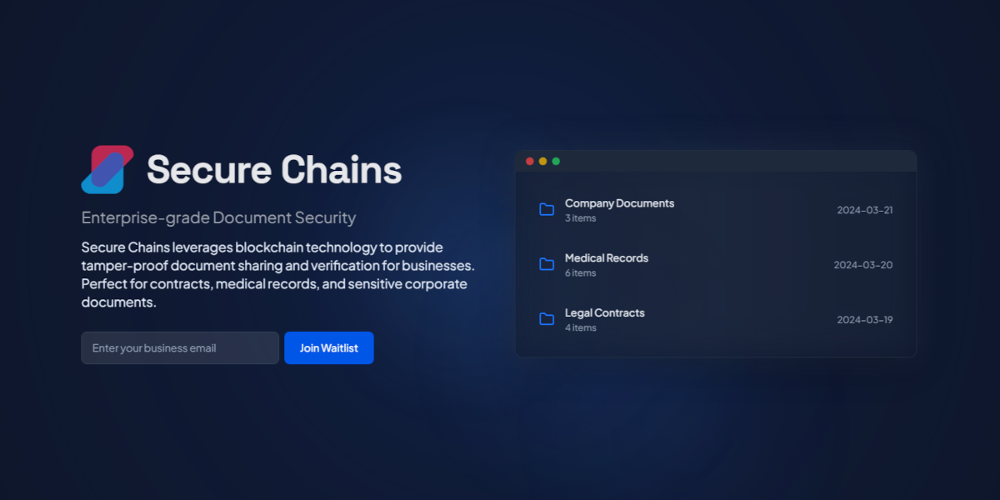

 
## 🔨 Languages and Tools:

 
## 📃 Badges

  
  
  
  
  
  
  
  

 

## 🌟 Projects/Products

| TaskCircle | Wearfy | SeuMimo |
|:---:|:---:|:---:|
|  |  |  |
| Task management platform with group and real time collaboration | Social platform for custom apparel | Digital souvenir platform |
| [🔗 Live Demo](https://taskcircle.vercel.app) | [🔗 Live Demo](https://wearfy.online) | [🔗 Live Demo](https://seumimo.com) |

| Readapt | LeetGroup | SecureChains |
|:---:|:---:|:---:|
|  |  |  |
| Digital library and reading tracker powered by accessibility using AI | Collaborative coding platform for leetcode | Blockchain security document sharing system |
| [🔗 Live Demo](https://readapt.vercel.app) | [🔗 Live Demo](https://leetgroup.vercel.app) | [🔗 Live Demo](https://securechains.vercel.app) |

